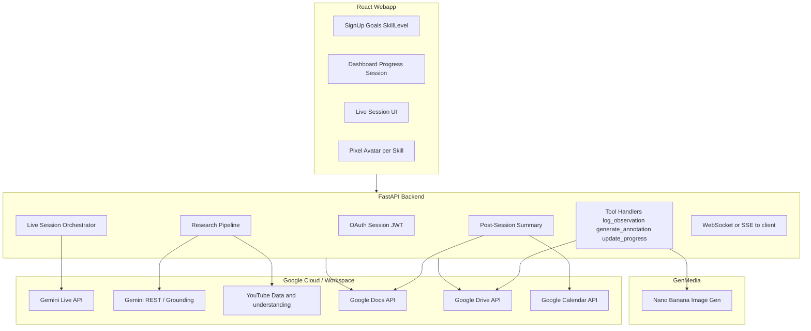

# AI Skill Learner — Implementation Plan

## Context

The repo at [UclaDeepMind](file:///Users/zanelabute/Downloads/Projects/glitch_hackathon_2026/UclaDeepMind) is currently empty aside from git metadata, so this is a **greenfield** layout. Your detailed spec is the source of truth; the short list mentioned **Google Docs + Photos**—the fuller design correctly uses **Docs + Drive + Calendar + YouTube**. **Recommendation:** treat **Google Drive** as the store for annotated frames and avatar assets (binary blobs, shareable links). Add **Google Photos Library API** only if you explicitly need user albums or Photos-native UX; for hackathon scope, Drive folders per user/session are simpler and sufficient.

**Naming:** Use **Nano Banana** (or your vendor’s exact SDK name) consistently in code for “annotate this frame” and “generate outfit variant” calls; keep a single image-generation client module so prompts differ by use case (spatial coaching vs. character sprite).

---

## Target architecture

**Why FastAPI in the middle:** Browser clients should not hold long-lived Gemini Live credentials or Workspace tokens for write scopes. The backend holds refresh tokens (encrypted at rest), proxies or brokers the Live connection, executes **function/tool calls** (your `log_observation`, `generate_annotation`, `update_progress`), triggers Nano Banana, and writes to Docs/Drive/Calendar.

---

## Repository layout (suggested)

| Path                            | Role                                                                                                                                                      |
| ------------------------------- | --------------------------------------------------------------------------------------------------------------------------------------------------------- |
| `backend/`                      | FastAPI app: routers (`auth`, `users`, `skills`, `sessions`, `research`, `live`), services (Gemini, Workspace, image gen), models (Pydantic), DB optional |
| `frontend/`                     | React (Vite + TypeScript): onboarding, dashboard, live session view, pixel avatar components                                                              |
| `docker-compose.yml` (optional) | Local dev: API + env files                                                                                                                                |
| `.env.example`                  | Document `GOOGLE_CLIENT_`, Gemini keys, Nano Banana endpoint/key                                                                                          |

Use a **small SQL DB** (SQLite for demo, Postgres if deploying) for **IDs, session metadata, and OAuth tokens**—not for the full skill model. **Canonical long-form memory** stays in **Google Docs** (and binary proof in **Drive**) as in your spec.

---

## User flow → product surfaces

1. **Sign up / Sign in** — Google OAuth with scopes: Docs (read/write), Drive (file create), Calendar (events), YouTube (read/search as needed). Store user id + tokens server-side.
2. **Set goals + skill level** — Form → persisted as initial **user model** snippet and session intent; triggers **research job** (async) or “research on first session.”
3. **AI generates plan** — Backend runs **Phase 1 Research**; writes structured **skill document** to a template Google Doc (or Doc created per user+skill); returns plan summary + doc link to the client.
4. **Dashboard** — Progress (streaks, XP, level per skill), next Calendar event, link to last Doc summary, **pixel character** per skill with outfit tied to level.
5. **Start session** — Client opens **live coaching** view: get microphone + camera (target **~1 FPS** video sampling on client before encode, to match Live constraints), audio stream; backend attaches **skill model + user model** to Live system instructions.
6. **Live coaching** — Gemini Live drives voice + reasoning; on tool call, backend runs Nano Banana for **annotated frames**, logs observations, updates in-memory escalation counters; returns image URL (Drive) to client for overlay.
7. **Post-session** — Generate summary (Gemini REST over session log + observations); append to Doc; update **user model** section in Doc; create/update **Calendar** next practice; save assets to **Drive**.
8. **Daily loop** — Calendar + optional push/email later; dashboard shows “prep clip” from research timestamps.

---

## Phase 1: Research (pre-coaching)

- **Inputs:** skill name, user level, goals.
- **Steps:** (1) Web/Search grounding via Gemini for fundamentals, mistakes, progression. (2) YouTube: search + select N tutorials; use video understanding (URLs in preview per your risk table) to extract **form checkpoints** and **timestamp references**.
- **Output:** Structured JSON → rendered into a **fixed-outline Google Doc** (sections: proper form, common mistakes, progression ladder, video refs with `t=` links).
- **API:** `POST /skills/{id}/research` → job id; `GET /skills/{id}/research/status` for polling.

---

## Phase 2: Live session + intervention engine

- **Session start:** Load latest skill Doc (or cached structured parse), load user model from Doc; build **system prompt** with two-tier context table.
- **Client transport:** Prefer **backend-mediated** Live session: either server opens Live and bridges audio/video (more complex), or **short-lived client token** pattern if your Gemini Live product supports it—**decide in implementation** based on official Live Web SDK + security docs. Minimum viable: client streams **frames + audio** to backend, backend forwards to Live API per current Google pattern.
- **Tool contracts (FastAPI):** Implement as Live **function declarations** mirrored by POST endpoints the internal orchestrator calls:
  - `log_observation(text, tier_suggestion?)`
  - `generate_annotation(frame_ref | image_bytes, instruction)` → Nano Banana → upload PNG to Drive → return `file_id` / public link
  - `update_progress(skill_key, delta, notes)`
- **Escalation state machine (server-side):** Per session, track counts of Tier 2 on same issue; after threshold → force Tier 3 path; Tier 3 fail → Tier 4 (return YouTube URL + timestamp). Persist summary only post-session; during session keep state in Redis or in-memory with session id.

---

## Phase 3–5: Post-session, between sessions, returning user

- **Post-session:** One Gemini call with structured output: wins, gaps, next focus, quotes from observations; **embed links** to Drive images in the Doc.
- **User model:** Maintain a dedicated subsection or linked Doc “User profile” that is **rewritten** each time (append-only history optional).
- **Calendar:** `events.insert` with title like “Skill: Knife skills — dice focus,” description = prep clip + Doc link.
- **Returning user:** On new session, re-fetch Docs content (or ETag cache) and inject; omit mastered mistakes from prompt when user model says so.

---

## Gamification: 2D pixel character + Nano Banana

- **Data model:** Each skill has `level` (1–N), `xp`, and `avatar_generation_version` (cache bust when outfit changes).
- **Visual approach:** Store **base pixel sprite** (static asset or simple canvas/CSS grid) in frontend; on level threshold, call backend `POST /avatar/render` with: skill id, level, palette seed, **last session summary keywords** → **Nano Banana** generates a **new outfit layer** or full sprite sheet; store PNG in **Drive**, URL in DB.
- **Progressive complexity:** Prompt template escalates with level (e.g., level 1 plain apron, level 3 hat + pattern, level 5 animated-style pose)—keep prompts in one module for judge demo repeatability.
- **Dashboard:** Show character, XP bar, and “next unlock at level X.”

---

## Key technologies mapping

| Your requirement    | Implementation note                                                                                                       |
| ------------------- | ------------------------------------------------------------------------------------------------------------------------- |
| **Gemini Live**     | Live API for multimodal stream; system prompt + tools; respect ~10 min session cap in UI (“Round 1 of 3”).                |
| **Nano Banana**     | HTTP/SDK client in `backend/services/image_gen.py`; two prompt templates: `annotation` vs `avatar_outfit`.                |
| **FastAPI**         | All Google writes and tool execution here; CORS for React origin.                                                         |
| **React**           | Vite + TS; routing for onboarding / dashboard / session; WebRTC or MediaRecorder for capture; display annotated overlays. |
| **Google Docs**     | Skill + user + session summaries; use Docs API batchUpdate for structured inserts.                                        |
| **Google Drive**    | Annotated frames, generated sprites, optional export of summaries as PDF.                                                 |
| **Google Calendar** | Next session scheduling.                                                                                                  |
| **YouTube**         | Research + Tier 4 deep links.                                                                                             |
| **Veo**             | Stub service interface; call only if no YouTube hit (optional for hackathon).                                             |

---

## Security and compliance (minimal but real)

- OAuth **least privilege** scopes; encrypt refresh tokens (e.g., Fernet + env secret).
- Never log raw video; log **observation text** and **frame hashes** only.
- Rate-limit `generate_annotation` to match 3–8s latency and cost.

---

## Demo script alignment (build order)

1. **Vertical slice:** Cooking skill only — research → Doc link → live session with one forced Tier 3 annotation → post-session Doc + Calendar event.
2. **Second skill:** Thin path to show research-from-scratch (60s script).
3. **Returning user:** Seed Doc + Drive with 5-session history; show session 6 prompt difference + timeline UI reading from Doc/Drive metadata.

---

## Risks (from your doc, engineering follow-ups)

- **1 FPS / 10 min:** Encode client-side frame throttle; UI copy sets expectations; cooking-first demo.
- **Generic feedback:** Prompt rubric + require observation quotes in tool args before `log_observation` accepts.
- **YouTube URL preview quirks:** Cache successful video ids; fallback to Search-only text refs.
- **Judges’ “just a camera app” narrative:** Dashboard must surface **Doc + Drive + Calendar** artifacts in one click from the live screen.
